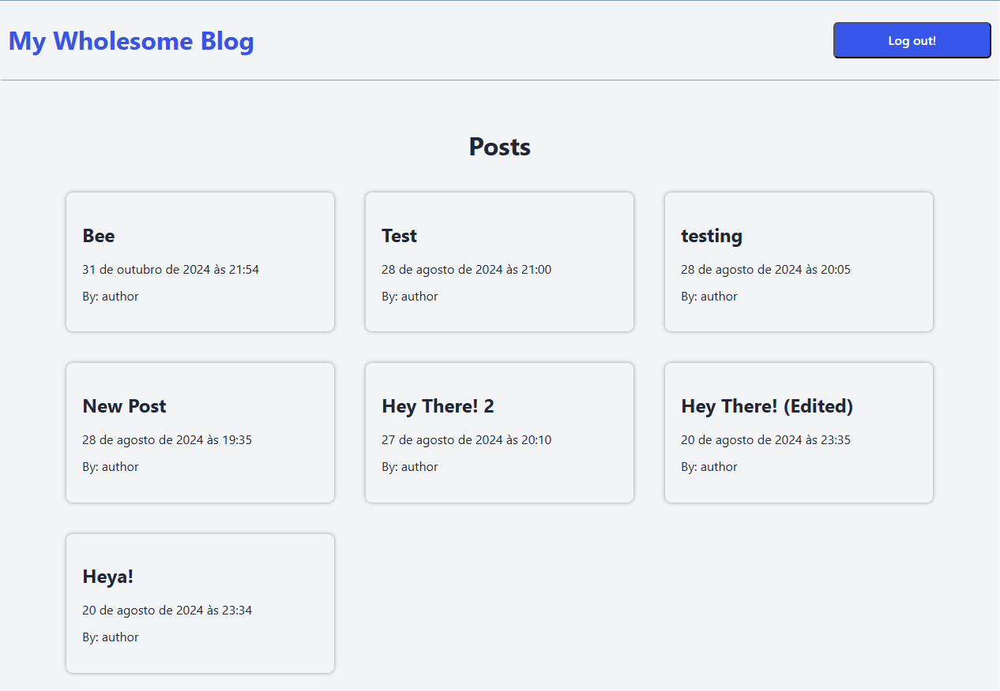

# Blog Dashboard

This is the user frontend part of my blog api project.
Check out the backend [here](https://github.com/AndreiFlau/Project---Blog-Api-Backend) and the dashboard frontend [here](https://github.com/AndreiFlau/Project---Blog-Api-Dashboard).



## Installation

After cloning and starting the [backend server](https://github.com/AndreiFlau/Project---Blog-Api-Backend), clone this repo and run the commands below on the project's directory to run it.

```powershell
  npm install
  npm run dev
```

# Credits

The emoji graphics are from the open source project Twemoji. The graphics are copyright 2020 Twitter, Inc and other contributors. The graphics are licensed under CC-BY 4.0. You should review the license before usage in your project.
